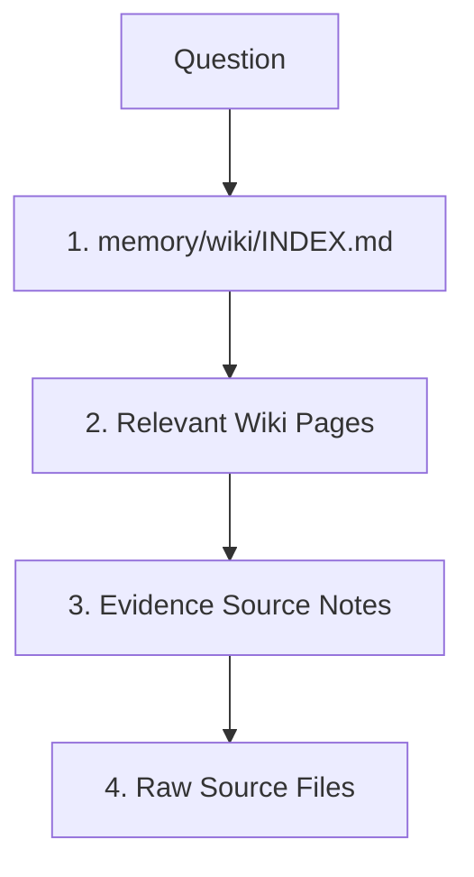
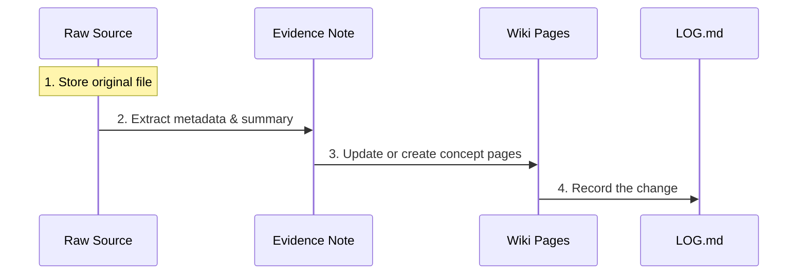

# Memoid

Memoid is a markdown-first memory system for AI agents that merges [Karpathy's LLM Wiki approach](https://gist.github.com/karpathy/442a6bf555914893e9891c11519de94f) and [MemPalace](https://github.com/MemPalace/mempalace).

It is designed to be your **"Global Second Brain"**—accessible by any AI agent (Claude, Gemini, Codex, Cursor, OpenCode) regardless of which project you are currently working on.

---

## 🧠 Philosophy & Rationale

Memoid was built to solve the "Agentic Amnesia" problem. While most RAG (Retrieval-Augmented Generation) systems treat memory as a hidden vector database, Memoid treats memory as a **transparent, human-readable wiki**.

### The Hybrid Advantage

By combining **Karpathy’s LLM Wiki** and **MemPalace**, Memoid offers:

- **Compounding Synthesis**: Knowledge isn't just "found"; it is compiled. The more you work, the more the Wiki improves.
- **Operational Discipline**: Explicit protocols (Wake-Up, Ingest, Filing) prevent the "pile of summaries" problem found in unmanaged wikis.
- **Evidence-Backed**: Every wiki claim is linked to an immutable raw source or a session record, ensuring you can always audit *why* the AI remembers something.
- **Zero Lock-in**: Your memory is just Markdown and Git. You can browse it in Obsidian, edit it in VS Code, or version control it like code.

### Feature Comparison

| Feature                          | Karpathy Wiki | MemPalace | Memoid (Hybrid) |
|:-------------------------------- |:-------------:|:---------:|:---------------:|
| **Markdown-First**               | ✅             | ❌         | ✅               |
| **Git-Native**                   | ✅             | ❌         | ✅               |
| **Immutable Raw Sources**        | ✅             | ✅         | ✅               |
| **Maintained Wiki Synthesis**    | ✅             | ❌         | ✅               |
| **Evidence & Session Records**   | ❌             | ✅         | ✅               |
| **Specialist Agent Continuity**  | ❌             | ✅         | ✅               |
| **Bounded Wake-Up Context**      | ❌             | ✅         | ✅               |
| **Explicit Operating Protocols** | ⚠️            | ✅         | ✅               |
| **MCP / Global Tool Access**     | ❌             | ❌         | ✅               |
| **Low Tooling Complexity**       | ✅             | ❌         | ✅               |

### Feature Glossary

- **Markdown-First**: Knowledge is stored in human-readable `.md` files, making it easy to browse in Obsidian, VS Code, or a terminal.
- **Git-Native**: Uses standard Git for version control. **Note**: most generated `memory/` content is ignored by the core Memoid engine repo by default, so you can keep the engine code and your private knowledge lifecycle separate.
- **Immutable Raw Sources**: Original documents (articles, transcripts) are never edited, serving as the permanent "ground truth" to back up wiki claims.
- **Maintained Wiki Synthesis**: Instead of just searching documents, the agent compiles and improves high-level "Entity" and "Concept" pages over time.
- **Evidence & Session Records**: A durable trail of session logs and source notes that explains exactly *how* and *why* a piece of knowledge was added.
- **Specialist Agent Continuity**: Persistent diaries for specialized agent roles (Researcher, Reviewer), allowing them to learn and improve their habits over time.
- **Bounded Wake-Up Context**: A "minimalist" startup protocol that prevents the agent from being overwhelmed by too much data at the start of a session.
- **Explicit Operating Protocols**: Clear Markdown instructions (`protocols/`) that define the agent's behavior, ensuring consistent ingestion and retrieval.
- **MCP / Global Tool Access**: Integration via Model Context Protocol, allowing any agent to access your brain from a different project's directory.
- **Low Tooling Complexity**: No specialized databases or vector stores required; if you can edit a text file, you can maintain Memoid.

### ⚠️ Limitations

- **Not a Vector DB**: It relies on text search and agent-led navigation. It is optimized for quality and context, not for millisecond-latency searches over millions of documents.
- **Agent Effort**: It requires the AI to perform "work" (following protocols) to maintain the memory. It is a system for high-quality synthesis, not low-effort data dumping.
- **Git Discipline**: To keep your memory synced across machines, you must manage your own Git pushes/pulls.

---

## 🏗️ Architecture

Memoid is 100% transparent. No databases, just interlinked Markdown files.

- **`memory/`**: The Data. Your compounding knowledge base (Raw sources, Wiki, Evidence).
- **`protocols/`**: The Rules. Markdown instructions that tell the AI how to Ingest, Retrieve, and File.
- **`scripts/`**: The Tools. A lean CLI for maintenance and an MCP server for global connectivity.

---

## 🚀 Quick Start

### 1. Unified Installation (Recommended)

Run the one-line installer to clone Memoid, install the CLI, automatically initialize the `memory/` workspace, and optionally add the Memoid MCP entry to detected agent configs.

**Linux / macOS:**

```bash
curl -sSL https://raw.githubusercontent.com/latentarts/memoid/main/scripts/install.sh | bash
```

**Windows (PowerShell):**

```powershell
powershell -ExecutionPolicy Bypass -c "irm https://raw.githubusercontent.com/latentarts/memoid/main/scripts/install.ps1 | iex"
```

*The installer will ask for your preferred path, install `uv` if missing, run `memoid init` for you, detect supported AI agents, and offer to update their MCP configs automatically. Once installed, you can still use the [MCP Setup](#-mcp-setup) section for manual configuration or verification.*

---

### 2. Manual Setup (Alternative)

If you prefer to do it yourself, `memoid init` remains a required manual step after cloning:

1. **Clone**: `git clone https://github.com/latentarts/memoid.git ~/memoid`
2. **Initialize**: `cd ~/memoid && ./scripts/memoid init`
3. **Update**: Keep your brain up to date with `./scripts/memoid update`
4. **Direct Access (Local)**: To work **inside** your knowledge base repo (e.g., to reorganize the wiki), run your agent via the Memoid CLI, for example: `memoid gemini`. This opens the agent in the Memoid repo root.
5. **Global Access (Cross-Project)**: Set up the [MCP Server](#-mcp-setup) in your agent's config.

---

## ▶️ Accessing Memoid

After installation, the main local entrypoint is the `memoid` CLI. Running `memoid <agent>` opens your agent directly in the Memoid repo root, which is the preferred way to do in-repo maintenance and protocol-driven work.

### Linux / macOS

```bash
memoid claude
memoid gemini
memoid codex
```

### Windows (PowerShell)

```powershell
memoid claude
memoid gemini
memoid codex
```

If the `memoid` command is not found, make sure the install location for the launcher was added to your `PATH`, then open a new shell and try again.

---

## 💡 Usage Examples

### Two Operating Modes

Memoid has two distinct modes. The right one depends on your current working directory.

- **Inside the Memoid repo (`~/memoid`)**: Use native tools and protocols. The agent should read `AGENTS.md`, follow `WAKE_UP.md`, and work directly with local files.
- **Outside the Memoid repo (another project)**: Use the Memoid MCP as a remote interface to your global memory. This is for recall, bounded orientation, and deliberate filing back into Memoid.

They can coexist in the same agent configuration, but they do **not** serve the same purpose.

- **Native in-repo mode** is the full-fidelity workflow: wake-up, protocol execution, repo-wide maintenance, richer judgment, and full lint/audit behavior.
- **MCP mode** is the remote access workflow: bounded wake-up, disciplined retrieval, scoped writes, and explicit audits when requested.

### Inside the Repo: Native Protocol Workflow

*Scenario: You are in `~/memoid` and want to maintain or reorganize your brain.*

**Prompt:** "Wake up and tell me what state this brain is in."

> **AI Action:** Checks initialization, reads `memory/wiki/IDENTITY.md`, `memory/wiki/ESSENTIAL_STORY.md`, and `AGENTS.md`, then follows `protocols/WAKE_UP.md`.

**Prompt:** "Find everything relevant to retrieval discipline and update the canonical page."

> **AI Action:** Uses native repo tools (`rg`, file reads, direct edits) and follows `protocols/RETRIEVAL.md` and `protocols/FILING.md` instead of the MCP.

**Prompt:** "Audit the wiki for contradictions and missing evidence links."

> **AI Action:** Runs the native maintenance path from `protocols/LINT.md`, which is the preferred path for full maintenance work.

**Prompt:** "Ingest this new source and update the right pages."

> **AI Action:** Follows the native ingest protocol in `protocols/INGEST.md` or `protocols/INGEST_CODE.md`, then verifies and files the results locally.

### Outside the Repo: MCP Recall and Filing

*Scenario: You are in `~/projects/my-app` and want to consult or update your global Memoid memory without leaving the current project.*

**Prompt:** "Search my Memoid for that OAuth2 pattern we used last month."

> **AI Action:** Calls `memoid_recall` to follow the retrieval ladder through `INDEX.md`, relevant wiki pages, linked evidence, and raw sources only if explicitly needed.

**Prompt:** "Wake up my Memoid context before we plan this migration."

> **AI Action:** Calls `memoid_wake_up` to load bounded startup context (`IDENTITY.md`, `ESSENTIAL_STORY.md`, and optionally `INDEX.md`), then uses `memoid_recall` if deeper retrieval is needed.

**Prompt:** "Did I ever document a retry pattern for API clients?"

> **AI Action:** Uses `memoid_recall` as disposable working context for the current task. Nothing is saved back to Memoid unless you explicitly ask for it.

**Prompt:** "Document this bug fix in my Memoid."

> **AI Action:** Calls `memoid_ingest` to save the source, create a source note, update a wiki page, refresh the index/log, and run scoped lint on the affected artifacts.

**Prompt:** "Update the Memoid concept page with what we just learned."

> **AI Action:** Calls `memoid_edit_wiki` to update the canonical wiki page while preserving structure, source links, index linkage, and scoped lint checks.

**Prompt:** "Save a durable note from this session in Memoid."

> **AI Action:** Calls `memoid_log` to file a structured session record under `memory/evidence/sessions/` and append a concise `LOG.md` entry.

**Prompt:** "Run a Memoid audit on the pages we touched."

> **AI Action:** Calls `memoid_audit` to create an explicit audit note under `memory/evidence/audits/`. This is optional maintenance from outside the repo, not a replacement for native full-repo maintenance.

### Rule of Thumb

- If you are **inside `~/memoid`**, prefer native tools and protocols.
- If you are **outside `~/memoid`**, prefer the MCP for lookup and deliberate filing.
- Use **`memoid_wake_up`** for broader outside-repo orientation.
- Use **`memoid_recall`** for narrow outside-repo lookup.
- Use **native in-repo maintenance** when you want the strongest audit, restructuring, or protocol-heavy work.

### Current MCP Tool Surface

The current Memoid MCP server exposes these tools:

- **`memoid_wake_up`**: Bounded startup context for outside-repo use.
- **`memoid_recall`**: Retrieval-ladder search with trust signals.
- **`memoid_ingest`**: Raw -> evidence -> wiki -> index -> log pipeline with scoped lint.
- **`memoid_edit_wiki`**: Structured canonical-page updates with source/index preservation.
- **`memoid_log`**: Session filing into `memory/evidence/sessions/` plus `LOG.md`.
- **`memoid_audit`**: Explicit outside-repo maintenance that writes to `memory/evidence/audits/`.

---

## 🛠️ CLI Commands

| Command          | Description                                                                                                             |
|:---------------- |:----------------------------------------------------------------------------------------------------------------------- |
| `memoid init`    | Prepares the directory structure. Safe to run multiple times; it will not delete existing data.                         |
| `memoid update`  | Updates the engine and protocols. **Never** overwrites your knowledge base (`memory/` folder).                          |
| `memoid mcp`     | Launches the MCP server for global connectivity.                                                                        |
| `memoid <agent>` | Launches an agent (e.g., `gemini`, `claude`, `codex`) in the Memoid repo root. Shortcut for opening the agent directly on `~/memoid`. |
| `memoid version` | Displays the current version.                                                                                           |

---

## 🔄 Core Workflows

Memoid is governed by simple, repeatable workflows. Here is how the AI interacts with your files.

### 1. Wake-Up (Context Reconstruction)

When you start a session, the AI doesn't read the whole wiki. It follows a "minimalist" sequence to understand who it is and what you are working on.


1. **`WAKE_UP.md`**: The AI reads its "bootstrap" instructions.
2. **`IDENTITY.md`**: It learns its role and your personal preferences.
3. **`ESSENTIAL_STORY.md`**: It gets up to speed on active projects and recent changes.

### 2. Search (The Retrieval Ladder)

To provide accurate, grounded answers, the AI climbs a "ladder" from high-level summaries down to the raw ground truth.



1. **Index**: Finds which pages might have the answer.
2. **Wiki**: Reads the compiled synthesis for a quick, high-quality answer.
3. **Evidence**: Checks the source notes to verify the "how" and "when."
4. **Raw**: Consults the original immutable document if absolute precision is required.

### 3. Ingest (The Knowledge Pipeline)

When you add new information, the AI follows a strict pipeline to ensure the knowledge is synthesized and logged, not just dumped.



1. **Raw**: The original file is stored permanently in `memory/raw/`.
2. **Evidence**: A "Source Note" is created in `memory/evidence/source-notes/` to preserve provenance.
3. **Wiki**: The AI updates one or more canonical pages in `memory/wiki/` with the new insights.
4. **Log**: The action is recorded in `memory/wiki/LOG.md` for a clear audit trail.

### 4. Audit (Consistency & Health)

To prevent drift and contradictions, the system undergoes regular audits to maintain the integrity of the second brain.


1. **Review**: Sample recent logs and active pages to identify drift or missing structure.
2. **Cross-Check**: Verify that wiki claims still align with their evidence notes.
3. **Log Findings**: Record maintenance tasks and inconsistencies in `memory/evidence/audits/`.
4. **Prune**: Move stale information to `History` sections to keep current pages focused.

---

## 📖 Key Protocols

Memoid doesn't use complex code for logic; it uses Markdown instructions in the `protocols/` folder:

- **`INGEST.md`**: How to turn a source into a Wiki page.
- **`RETRIEVAL.md`**: How to find the most accurate answer.
- **`FILING.md`**: What deserves to be saved permanently.
- **`LINT.md`**: How to perform consistency audits.
- **`WAKE_UP.md`**: How the agent reconstructs its context at the start of a session.

---

## 🔌 MCP Setup

Memoid uses the [Model Context Protocol (MCP)](https://modelcontextprotocol.io/) to provide your global brain to any AI agent. To enable this, you must add Memoid as a server in your agent's configuration.

Once connected, the MCP server gives outside-repo agents bounded wake-up, disciplined retrieval, deliberate filing, and explicit audits without requiring them to operate directly inside `~/memoid`.

### Configuration for AI Agents

#### **Claude Desktop**
Edit your `claude_desktop_config.json` (usually at `~/.config/Claude/claude_desktop_config.json` on Linux or `~/Library/Application Support/Claude/claude_desktop_config.json` on macOS):

```json
{
  "mcpServers": {
    "memoid": {
      "command": "memoid",
      "args": ["mcp"]
    }
  }
}
```

#### **OpenCode**
Edit your `opencode.json` (usually at `~/.config/opencode/opencode.json`):

```json
{
  "mcp": {
    "memoid": {
      "type": "local",
      "command": ["memoid", "mcp"],
      "enabled": true
    }
  }
}
```

#### **Gemini CLI**
These CLIs typically use a `~/.gemini/settings.json` file. Ensure they are configured to point to the Memoid MCP server:

```json
{
  "mcpServers": {
    "memoid": {
      "command": "memoid",
      "args": ["mcp"]
    }
  }
}
```

#### **Codex**
Add the following to your `codex.toml` configuration file:

```toml
[mcp_servers.memoid]
command = "memoid"
args = ["mcp"]
```

---

## 🔧 Troubleshooting

### Agent Command Not Found
If you get an error like `Error: Agent command 'gemini' not found in PATH`, ensure that the agent CLI is installed globally on your system.

**For npm-based CLIs (Gemini, Codex, etc.):**
```bash
sudo npm install -g @google/gemini-cli
sudo npm install -g @openai/codex
```

**For other CLIs:**
Ensure the binary is in your `$PATH` (e.g., in `/usr/local/bin` or `~/.local/bin`). You can verify this by running `command -v <agent_name>` in your terminal.

---

## 📜 License

MIT - Created by [prods](https://github.com/latentarts)
