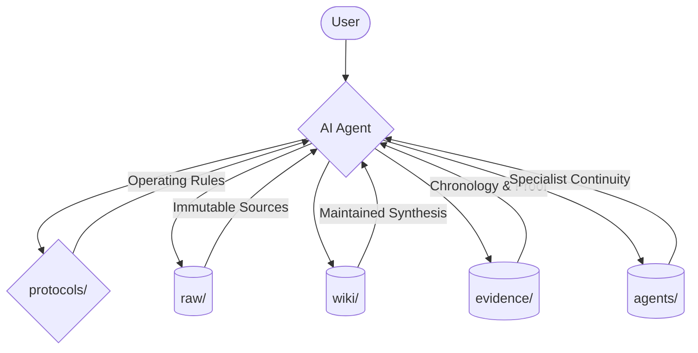
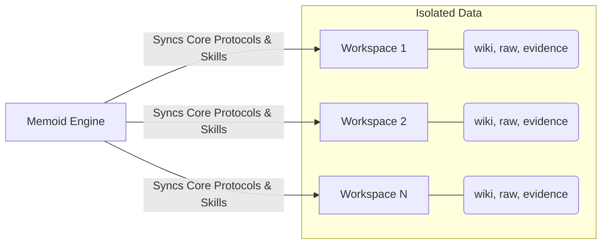

# Memoid

> [!WARNING]
> This is experimental and it's being tested.

Memoid is a markdown-first memory system for AI agents that merges [Karpathy's LLM Wiki approach](https://gist.github.com/karpathy/442a6bf555914893e9891c11519de94f) and [MemPalace](https://github.com/MemPalace/mempalace).

It maintains a persistent wiki that compounds over time, adding operational discipline to ensure the wiki stays useful as a grounded memory layer instead of an ungrounded pile of summaries.



## Three Ways to Use Memoid

Memoid is designed to be flexible, supporting everything from a single project to a multi-workspace fleet.

### 1. Direct Clone (The "Template" Model)
If you only need one memory system for one project:
1. `git clone https://github.com/prods/memoid.git my-project`
2. `cd my-project && uv sync`
3. Start your AI agent. The repo comes pre-configured with a clean `wiki/` and `agents/` structure.

### 2. Managed Engine (The "Launcher" Model)
If you want to manage multiple workspaces from a single central engine:
1. Run the [One-Line Install](#installation--upgrades).
2. This creates an engine in `~/Documents/memoid/memoid-engine`.
3. It creates isolated workspaces in `~/Documents/memoid/workspaces/`.
4. Your personal data in `wiki/`, `raw/`, etc., is never overwritten when you update the engine.

### 3. CLI Dispatcher (The "Power User" Model)
Once installed via the launcher, the `memoid` CLI becomes your primary tool:
- `memoid ls`: List your workspaces.
- `memoid new <name>`: Create a new isolated knowledge base.
- `memoid <workspace> <agent>`: Launch an agent (like `claude` or `gpt4`) directly inside a specific workspace.



## Installation & Upgrades

> [!IMPORTANT]
> This step is optional. The `memoid` script is just a way to simplify updating, creating workspaces, and running the AI agents on them, but the same can be achieved by just cloning the repo in different folders and starting the AI agent on it.

### One-Line Install (Linux/macOS)
```bash
curl -sSL https://raw.githubusercontent.com/prods/memoid/main/scripts/install.sh | bash -s my-workspace
```

### One-Line Install (Windows PowerShell)
```powershell
powershell -ExecutionPolicy Bypass -c "& { $(irm https://raw.githubusercontent.com/prods/memoid/main/scripts/install.ps1) } my-workspace"
```

### CLI Commands

| Command | Description |
| :--- | :--- |
| `memoid <workspace> <agent> [args...]` | Launches any agent within a workspace. Example: `memoid personal claude` |
| `memoid new <name>` | Creates a new workspace and seeds it with the required folders and templates. |
| `memoid ls` | List all available workspaces. |
| `memoid update` | Pulls the latest engine changes and syncs your current workspace while preserving data. |
| `memoid version` | Displays the current engine version (git tag). |

- **Mechanism**: Automatically symlinks `memoid` into `~/.local/bin/memoid` (Linux/macOS) or `memoid.ps1` (Windows) for global access.
- **Data Preservation**: Upgrades preserve your `raw/`, `wiki/`, `evidence/`, and `agents/` directories.
- **Developer Mode**: Use `--local` with the install scripts to use the engine from the current directory instead of cloning from GitHub.
- **Dependencies**: Requires `git`, `rsync` (Linux/macOS) or `robocopy` (Windows), and [uv](https://github.com/astral-sh/uv).

## Repository Layout

```text
raw/        immutable source material
wiki/       maintained knowledge surface (templates only in repo)
evidence/   support records and chronology
agents/     specialist memory streams
protocols/  operating rules for the agent
```

Key files:

- [wiki/IDENTITY.md](./wiki/IDENTITY.md): who the main agent is and how it should behave
- [wiki/ESSENTIAL_STORY.md](./wiki/ESSENTIAL_STORY.md): bounded current-state brief
- [wiki/INDEX.md](./wiki/INDEX.md): main navigation page
- [wiki/LOG.md](./wiki/LOG.md): chronology of major ingests and changes
- [protocols/WAKE_UP.md](./protocols/WAKE_UP.md): minimal startup behavior
- [protocols/RETRIEVAL.md](./protocols/RETRIEVAL.md): how the agent should answer questions
- [protocols/INGEST.md](./protocols/INGEST.md): how to add new knowledge
- [protocols/FILING.md](./protocols/FILING.md): what deserves persistence
- [protocols/COMPACTION.md](./protocols/COMPACTION.md): what to preserve before context loss

## Why This Exists

This repository exists to bring MemPalace-style discipline into the Karpathy wiki approach.

Karpathy's pattern is the architectural foundation: use immutable raw sources plus a maintained markdown wiki so knowledge compounds over time instead of being rediscovered from scratch on every query.

MemPalace contributes the discipline layer:
- bounded wake-up context
- layered retrieval
- evidence preservation
- compaction and filing discipline
- specialist continuity
- current-vs-history fact handling

The result is a memory system that compounds instead of resetting.

## How It Works

### 0. Initialization
On first use, initialize the repo:
1. `uv sync`
2. `uv run python scripts/post_init_check.py`

### 1. Wake-Up
At the beginning of a session, the agent should read only:
- `protocols/WAKE_UP.md`
- `wiki/IDENTITY.md`
- `wiki/ESSENTIAL_STORY.md`

### 2. Retrieval
When a question arrives, the agent uses this ladder:
1. `wiki/INDEX.md`
2. Relevant wiki pages
3. Linked evidence pages
4. Raw sources

### 3. Ingest
When adding a new source:
1. Store it under `raw/`
2. Create a source note under `evidence/source-notes/`
3. Update relevant wiki pages and the index/log.

## Included Skills

Project-local skills are provided under `skills/`:

- `skills/init/`: Prepare the repo for first use.
- `skills/download-urls/`: Download URLs/YouTube transcripts into `raw/`.
- `skills/wake-up/`: Initialize from bounded context.
- `skills/ingest/`: Turn raw sources into wiki knowledge.
- `skills/retrieval/`: Answer from maintained knowledge first.
- `skills/filing/`: Preserve durable knowledge from a session.
- `skills/compaction/`: Write a handoff before context loss.
- `skills/lint/`: Audit the repo for drift and missing structure.

## Best Practices

- **Keep `raw/` immutable.**
- **Link wiki claims to evidence.**
- **Use `Current` and `History` sections** for facts that can change.
- **Run periodic lint passes** to catch drift.

## Related Files

- [SPEC.md](./SPEC.md): formal architecture and rationale
- [protocols/SCHEMA.md](./protocols/SCHEMA.md): page and naming conventions
- [wiki/INDEX.md](./wiki/INDEX.md): current navigation entry point
