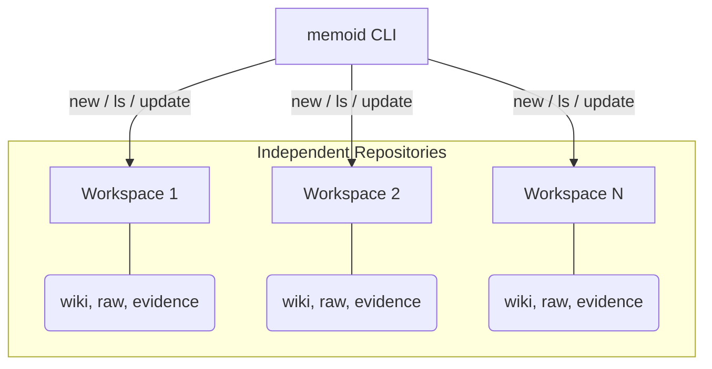

# Memoid

> [!WARNING]
> This is experimental and it's being tested.

Memoid is a markdown-first memory system for AI agents that merges [Karpathy's LLM Wiki approach](https://gist.github.com/karpathy/442a6bf555914893e9891c11519de94f) and [MemPalace](https://github.com/MemPalace/mempalace).

It maintains a persistent wiki that compounds over time, adding operational discipline to ensure the wiki stays useful as a grounded memory layer instead of an ungrounded pile of summaries.


## Two Ways to Use Memoid

Memoid is designed to be flexible, supporting everything from a single project to a multi-workspace fleet.

### 1. Direct Clone (The "Template" Model)

If you only need one memory system for one project:

1. `git clone https://github.com/prods/memoid.git my-project`
2. `cd my-project && uv sync`
3. Start your prefered AI agent on the cloned repo path. 
   *The repo comes pre-configured with a clean `wiki/` and `agents/` structure.*

### 2. Managed Workspaces (The "CLI" Model)

If you want to manage multiple isolated knowledge bases (workspaces):

1. Run the [One-Line Install](#installation--upgrades) to create your first workspace and install the `memoid` CLI.
2. Use `memoid new <name>` to create additional workspaces.
3. Use `memoid ls` to list your workspaces.
4. Use `memoid <workspace> <agent>` to launch an agent (like `claude` , `codex` or `gemini`) directly inside a specific workspace.



## Installation & Upgrades

> [!IMPORTANT]
> This step is optional. The `memoid` script is just a way to simplify updating, creating workspaces, and running the AI agents on them, but the same can be achieved by just cloning the repo in different folders and starting the AI agent on it.

### One-Line Install (Linux/macOS)

```bash
curl -sSL https://raw.githubusercontent.com/prods/memoid/main/scripts/install.sh | bash -s my-workspace
```

### One-Line Install (Windows PowerShell)

```powershell
powershell -ExecutionPolicy Bypass -c "& { $(irm https://raw.githubusercontent.com/prods/memoid/main/scripts/install.ps1) } my-workspace"
```

### CLI Commands

| Command                                | Description                                                         |
|:-------------------------------------- |:------------------------------------------------------------------- |
| `memoid <workspace> <agent> [args...]` | Launches any agent within a workspace.                              |
| `memoid new <name>`                    | Creates a new isolated workspace by cloning the repo.               |
| `memoid ls`                            | List all available workspaces.                                      |
| `memoid update [name]`                 | Pulls the latest changes for a workspace (defaults to current dir). |
| `memoid version [name]`                | Displays the version of a workspace (defaults to current dir).      |

- **Mechanism**: Automatically symlinks `memoid` into `~/.local/bin/memoid` (Linux/macOS) or `memoid.ps1` (Windows) for global access.
- **Developer Mode**: Use `--local` with the install scripts to clone from your local engine copy instead of GitHub.
- **Dependencies**: Requires `git` and [uv](https://github.com/astral-sh/uv) (required to support Python-based skills).

## Repository Layout

```text
raw/        immutable source material
wiki/       maintained knowledge surface (templates only in repo)
evidence/   support records and chronology
agents/     specialist memory streams
protocols/  operating rules for the agent
```

Key files:

- [wiki/IDENTITY.md](./wiki/IDENTITY.md): who the main agent is and how it should behave
- [wiki/ESSENTIAL_STORY.md](./wiki/ESSENTIAL_STORY.md): bounded current-state brief
- [wiki/INDEX.md](./wiki/INDEX.md): main navigation page
- [wiki/LOG.md](./wiki/LOG.md): chronology of major ingests and changes
- [protocols/WAKE_UP.md](./protocols/WAKE_UP.md): minimal startup behavior
- [protocols/RETRIEVAL.md](./protocols/RETRIEVAL.md): how the agent should answer questions
- [protocols/INGEST.md](./protocols/INGEST.md): how to add new knowledge
- [protocols/FILING.md](./protocols/FILING.md): what deserves persistence
- [protocols/COMPACTION.md](./protocols/COMPACTION.md): what to preserve before context loss

## Why This Exists

This repository exists to bring MemPalace-style discipline into the Karpathy wiki approach.

Karpathy's pattern is the architectural foundation: use immutable raw sources plus a maintained markdown wiki so knowledge compounds over time instead of being rediscovered from scratch on every query.

MemPalace contributes the discipline layer:

- bounded wake-up context
- layered retrieval
- evidence preservation
- compaction and filing discipline
- specialist continuity
- current-vs-history fact handling

The result is a memory system that compounds instead of resetting.

## How It Works

### 0. Initialization

On first use, initialize the repo. **Note: [uv](https://github.com/astral-sh/uv) is required to manage the environment and support Python-based skills.**

1. `uv sync`
2. `uv run python scripts/post_init_check.py`

### 1. Wake-Up

At the beginning of a session, the agent should read only:

- `protocols/WAKE_UP.md`
- `wiki/IDENTITY.md`
- `wiki/ESSENTIAL_STORY.md`

### 2. Retrieval

When a question arrives, the agent uses this ladder:

1. `wiki/INDEX.md`
2. Relevant wiki pages
3. Linked evidence pages
4. Raw sources

### 3. Ingest

When adding a new source:

1. Store it under `raw/`
2. Create a source note under `evidence/source-notes/`
3. Update relevant wiki pages and the index/log.

## Included Skills

Project-local skills are provided under `skills/`:

- `skills/init/`: Prepare the repo for first use.
- `skills/download-urls/`: Download URLs/YouTube transcripts into `raw/`.
- `skills/wake-up/`: Initialize from bounded context.
- `skills/ingest/`: Turn raw sources into wiki knowledge.
- `skills/retrieval/`: Answer from maintained knowledge first.
- `skills/filing/`: Preserve durable knowledge from a session.
- `skills/compaction/`: Write a handoff before context loss.
- `skills/lint/`: Audit the repo for drift and missing structure.

## Best Practices

- **Keep `raw/` immutable.**
- **Link wiki claims to evidence.**
- **Use `Current` and `History` sections** for facts that can change.
- **Run periodic lint passes** to catch drift.

## Related Files

- [SPEC.md](./SPEC.md): formal architecture and rationale
- [protocols/SCHEMA.md](./protocols/SCHEMA.md): page and naming conventions
- [wiki/INDEX.md](./wiki/INDEX.md): current navigation entry point
